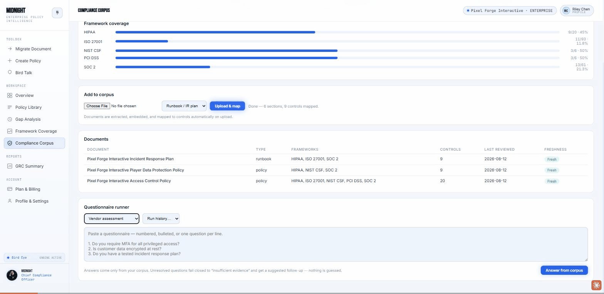
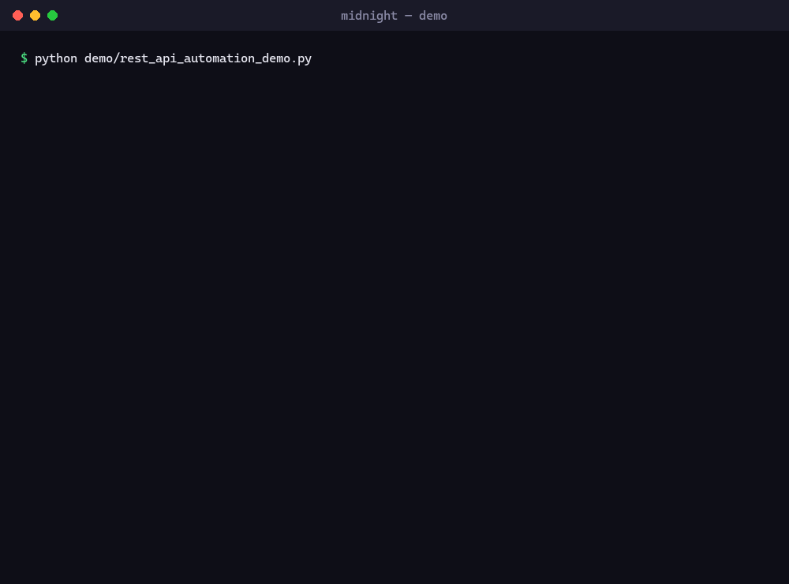
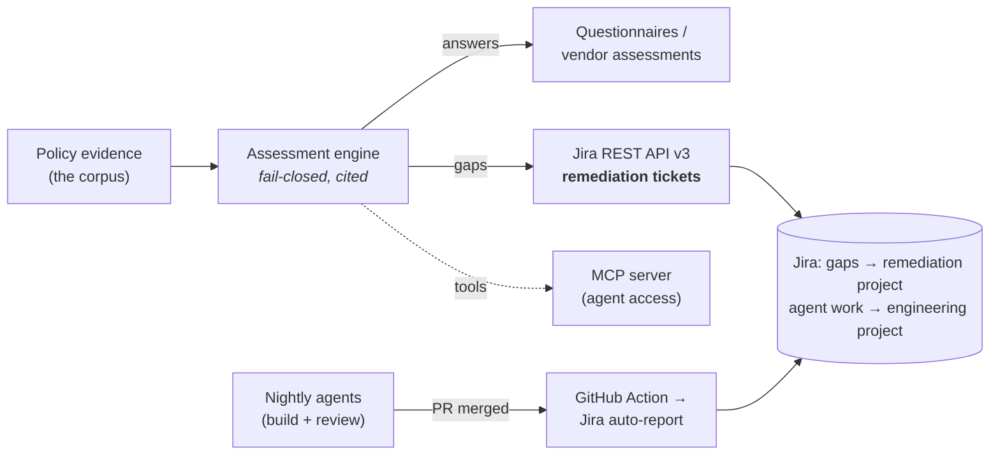

# Midnight — Security & Compliance Automation

**An evidence-grounded GRC platform that turns policy evidence into control mappings, cited questionnaire answers, and *automated* remediation workflows — built, deployed, and adversarially tested.**

Live app · [midnight-core-cod3.onrender.com](https://midnight-core-cod3.onrender.com) — Python (FastAPI) + Supabase + a pluggable LLM provider layer (Claude / Groq / local).



*Answering a vendor security assessment from the evidence corpus — cited answers, gaps surfaced, remediation drafted.*

---

## Why this exists

Compliance tools mostly *complete questionnaires*. Midnight treats compliance as an evidence problem: it answers from an organization's **own** policy corpus with exact-quote citations, **fails closed** to "insufficient evidence" instead of guessing, and turns the gaps it finds into **tracked remediation work** — automatically, against the tools teams already use.

This folder is a focused demo of the piece most relevant to a **Security Automation Engineer**: *building automation and integrations against REST APIs and MCP servers.*

---

## Run the demo (30 seconds, no setup)

Drives the **real production Jira client** through an in-process mock — no credentials, no network:

```bash
python demo/rest_api_automation_demo.py
```



The demo drives the exact production client through the full REST flow: authenticate → surface a gap → `POST /rest/api/3/issue` (ADF body) → read status back. Point it at a real Jira with `--live` and `JIRA_SITE_URL` / `JIRA_EMAIL` / `JIRA_API_TOKEN` / `JIRA_PROJECT_KEY`.

---

## Three pillars

### 1 · Integrations against REST APIs
A fail-closed **Jira Cloud REST API v3** client: Basic auth, Atlassian Document Format payloads, clean error surfacing, no token logging. A detected gap becomes a Jira issue (`[control] summary`, source document ID in the body, framework + severity labels); status syncs back.
→ `../backend/integrations/jira_client.py` · `../backend/api/integrations.py`
**Proof:** the recording above is the exact create-issue call; in production it writes a real ticket into the tenant's own Jira project, then syncs the status back.

### 2 · Automation against MCP servers
Midnight ships its **own MCP server** exposing the platform's REST API as agent tools (`get_posture`, `answer_questions`, `assign_to_reviewer`, `draft_document`, …) — so any MCP client can operate a compliance workspace.
→ `../mcp_server/midnight_mcp.py`

### 3 · Security automation
An adversarial **production test battery** — forged JWTs, unauthorized access, cross-tenant reads, path traversal, malformed payloads, oversized requests, and concurrency — plus tenant isolation, input caps, rate limiting, and security headers, validated against the live deployment.

---

## Architecture



Plan → do → comply, all landing in Jira: work is **planned** as a scheduled Epic, the nightly agents **auto-report** their completed work, and compliance gaps **push** to a remediation project — each verified live by reading it back out of Jira.

---

## Measured assurance *(point-in-time; conservative on purpose)*

- **250 passing automated tests**, green in CI on every push.
- **22 / 22 adversarial production scenarios defended**, including 40 concurrent requests with zero HTTP 500s. *(2 of the 22 — SQL-injection-pattern payloads — were blocked upstream by the platform edge before reaching the app; that's observed protection, not a control I claim to have built.)*
- Autonomous **build → review → report** loop delivering changes through a documented PR workflow.

---

## Stack
Python · FastAPI · Supabase (Postgres + pgvector) · httpx · python-docx · GitHub Actions CI · Jira Cloud REST API v3 · Model Context Protocol · a pluggable LLM provider layer (Claude / Groq / local).

*Built solo. Metrics are stated point-in-time and framed conservatively — the security posture is "defended these scenarios," not "provably unbreakable."*
